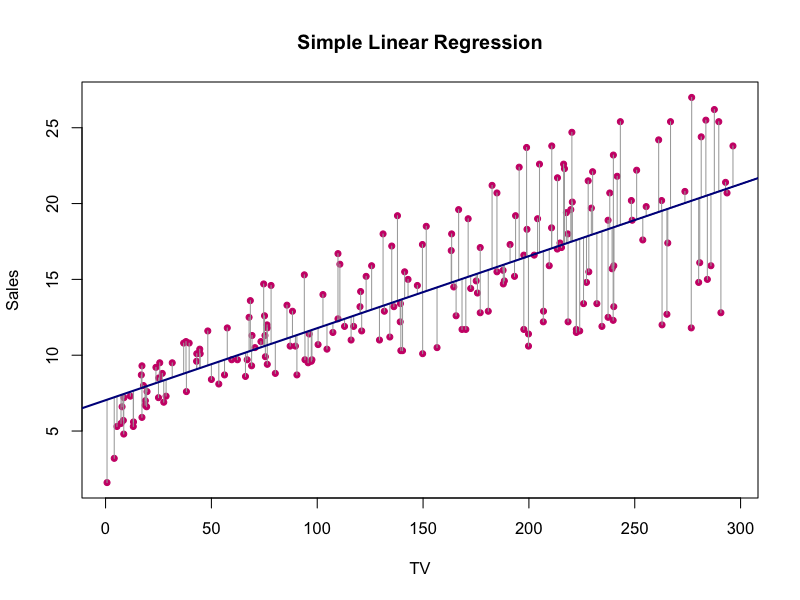

#Abstract 

This report is about reproducing a simple regression analysis from Section 3.1 (pages 59-71), of *Chapter3. Linear Regression*, from the book "An Introduction to Statistical Learning" [(by James et al)](http://www-bcf.usc.edu/~gareth/ISL/)


# Introduction

The goal is to provide advice on how to improve sales of the particular product. The idea is to determine whether there is relationship between advertising expenditure and sales, and if so, we would like to know the strengh of this relationship and then we can instruct our client to adjust advertising budgets, thereby indirectly increasing sales.In other word, our goal is to develop an accurate model that can be used to prodect sales on the basis of the three media (TV, radio, newspaper) budgets.


# Data

The [Advertising data set](http://www-bcf.usc.edu/~gareth/ISL/Advertising.csv) consists of Sales (in thousands of units) of a particular product in 200 different markets (n = 200), along with advertising budgets (in thousands of dollars) for the product in each of those markets for three different media: TV, Radio, and Newspaper.


# Methodology

## Simple Linear Regression equation

We suppose that only one media from the data set, **TV**, has an association with **Sales**. Therefore, we use a simple linear model: 

$$ \hat{Sales} = \hat{\beta_0} + \hat{\beta_1} \times TV $$

we have used our training data to produce estimates $\hat{\beta_0}$ and $\hat{\beta_1}$ for the model coefficients, where $\hat{Sales}$ indicates a prediction of *Sales* on the basis of *TV*. 
To estimate the coefficients we fit a regression model via the least squares criterion.

## Estimating the Coefficients
We use data to estimate the coefficients by:
$$ (x_1, y_1), (x_2, y_2), ... , (x_{200}, y_{200})$$
represents  200 observation pairs, each of which consists of a measurement of $X$ (which is *TV*) and a measurement of $Y$ (which is *Sales*)

Let $$\hat{y_i} = \hat{\beta_0} + \hat{\beta_1}\times x_i $$ 
be the prediction for $Y$ based on the ith value of $X$. Then $e_i = y_i - \hat{y_i}$ rperesents the *i*th *residual* -- this is the difference between the *i*th observed response value and the *i*th response value that is predicted by our linear model. The *residual sum of squares* (RSS) is:
$$ RSS = e_1^2 + e_2^2 + ... + e_{200}^2 $$

or equivalently as 
$$RSS = (y_1 - \hat{\beta_0} - \hat{\beta_1} * x_1)^2 + (y_2 - \hat{\beta_0} - \hat{\beta_1}*x_2)^2 + ... + (y_{200} - \hat{\beta_0} - \hat{\beta_1}*x_{200})^2$$
The least squares approach chooses $\hat{\beta_0}$ and $\hat{\beta_1}$ to minimize the RSS. 


$$\hat{\beta_1} = \frac{\sum_{i=1}^{n}\left(x_{i}-\bar{x}\right)\left(y_i - \bar{y}\right)}{\sum_{i=1}^{n} 
  \left(x_{i} - \bar{x}\right)^{2}}$$
  
$$\hat{\beta_0} = \bar{y} - \hat{\beta_1}\bar{x}$$
where $\bar{y} = \frac{1}{n}\sum_{i=1}^{n}y_i$ and $\bar{x} = \frac{1}{n}\sum_{i=1}^{n}x_i$


## Residual standard error
standard error assiciated with $\hat{\beta_0}$ and  $\hat{\beta_1}$, we use the following formulas:
$$SE(\hat{\beta_0})^2 = \sigma^2\left[\frac{1}{n}+\frac{\bar{x}^2}{\sum_{i=1}^{n} 
  \left(x_{i} - \bar{x}\right)^{2}}\right]$$
$$SE(\hat{\beta_1})^2 = \frac{\sigma^2}{\sum_{i=1}^{n} 
  \left(x_{i} - \bar{x}\right)^{2}}$$

The estimate of $\sigma$ is known as the *residual standard error*:
$$RSE = \sqrt{RSS/(n-2)}$$

The RSE is considered a measure of the *lack of fit* of the model to the data. If the predictions obtained using the model are very close to the true outcome values then RSE will be small, and we can conclude that the model fits the data very well. On the other hand, if $\hat{y_i}$ is very far from $y_i$ for one or more observations, then the RSE may be quite large, indicating that the model doesn't fit the data well. 

## $R^2$ Statistic

The RSE provides an absolute measure of lack of fit of the model to the data. But since it is measured in the units of $Y$, it is not always clear what constitutes a good RSE. The $R^2$ statistic provides an alternative measure of fit. It takes the form of a proprotion -- the proportion of variance explained -- and so it always takes on a value between 0 and 1, and is independent of the scale of $Y$.
$$R^2 = \frac{TSS - RSS}{TSS} = 1 - \frac{RSS}{TSS}$$
where $TSS = \sum\left(y_i-\bar{y}\right)^2$ is the *total sum of squares*, and *Residual sum of squares* $RSS = \sum_{i=1}^n\left(y_i-\hat{y_i}\right)^2$. TSS measures the total vairance in the resonse $Y$, and can be thought of as the amount of variability inherent in the response before the regression is performed. In contrast, RSS measures the amount of variability that is left unexplained after performing the regression. Hence, TSS-RSS measures the amount of variability in the response that is explained (or removed) by performing the regression, and $R^2$ measures the *proportion of variability in Y that can be explained using X*. 

An $R^2$ statistic that is close to 1 indicates taht a large proportion of the variability in the response has been explained by the regression. A number near 0 indicates that the regression did not explain much of the variability in the response; this might be occur because the linear model is wrong, or the inherent error $\sigma^2$ is high, or both. 

# Results

{r fig.cap="Some text here", echo = FALSE}
library(png)
library(grid)
img <- readPNG("../images/scatterplot-tv-sales.png")
grid.raster(img)



This figure is the plot of Least Squares Simple Linear Regression.

For the Advertising data, the least squares fit for the regression of Sales onto TV is shown. The fit is found by minimizing the sum of squared errors. Each grey line segment represents an error, and the fit makes a compromise by averaging their squares. In this cuase a linear fit captures the essence of the relationship, although it is somewhat deficient in the left of the plot."

```{r xtable, results = 'asis',warning=FALSE, message=FALSE, echo=FALSE, comment = FALSE}
load("../data/regression.RData")
library(xtable)
# table 1:
print(xtable(summary(reg)$coef, caption = "Information about Regression Coefficients", type = "Latex"),comment = FALSE)
```

Table 1 displays the simple linear regression fit to the `Advertising` data, where $\hat{\beta_0} = 7.03$ and $\hat{\beta_1} = 0.05$. In other words, according to this approximation, an additional $1,000 spent on TV advertising is associated with selling approximately 50 additional units of the product. 

Table 1 also provides details that t-statistics are large, this is because the coefficients for $\hat{\beta_0}$ and  $\hat{\beta_1}$ are very large relatvie to their standard errors. The probabilities of seeing such values if $H_0$ is true are virtually zero. Hence we can conclude that $\hat{\beta_0}$ and  $\hat{\beta_1}$ do not equal to 0.

The small p-value in Table 1 for the intercept indicates taht we can reject the null hypothesis that $\hat{\beta_0} = 0$, and a small p-value for *TV* indicates that we can reject the null hypothesis that $\hat{\beta_1} = 0$. Rejecting the latter null hypothesis allows us to conclude that there is relationship between *TV* and *Sales*. Rejecting the former allows us to conclude that in the absence of *TV* expenditure, *Sales* are non-zero. 

```{r,results = 'asis',warning=FALSE, message=FALSE, echo=FALSE, comment = FALSE}
#table 2: 
f = summary(reg)$fstatistic
rse = summary(reg)$sigma
bb = summary(reg)
# R-square
r2 = bb$r.squared
c = c("Residual standard error","R2", "F-statistic")
v = c(rse,r2,f[1])
qq = data.frame(c,v)
colnames(qq) <- c("Quantity","Value")
print(xtable(qq, type = "html", caption = "Regression Quality Indices"),comment = FALSE, include.rownames = FALSE)
```

In Table 2, the RSE is 3.26, which means that actual sales in each market deviate from the true regression line by approximately 3.260 units, on average. If the model were correct and the true values of the unknown coefficients $\hat{\beta_0}$ and $\hat{\beta_1}$ were known exactly, any prediction of sales on the basis of *TV* advertising would still be off by about 3,260 units on average. The $R^2$ is 0.61, and so just under two-thirds of the variability in *sales* is explained by a linear regression on *TV*. In F-statistics, the null hypothesis is that the coefficient $\beta_1$ is almost equals to 0 which means *TV* has no linear relationship with *Sales*. The bigger the value of F, the stronger to rejects the null. Therefore, in Table 2, $F = 312.14$ is relatively very large. Therefore, it gives the information that $\beta_1$ is statistically significant.  


# Conclusions
For the caption of plot, I put it in subtitle when I was plotting it. This is because somehow my computer can't generate caption using ``. I went to professor Sanchez's office hour, and he couldn't figure it out either. So he asked me to write this notes in Conclusions section to let you know. 


